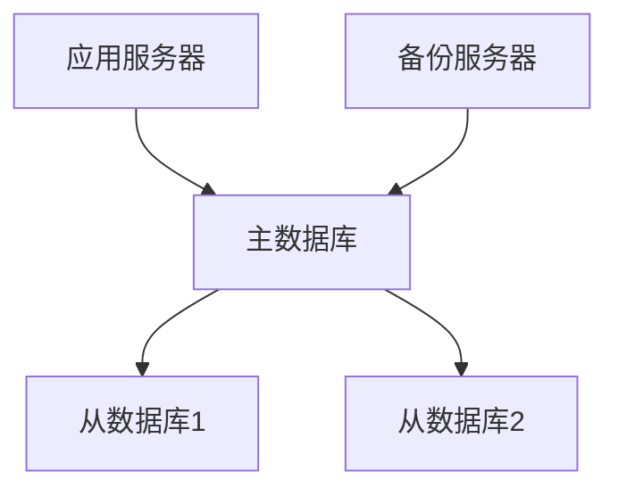
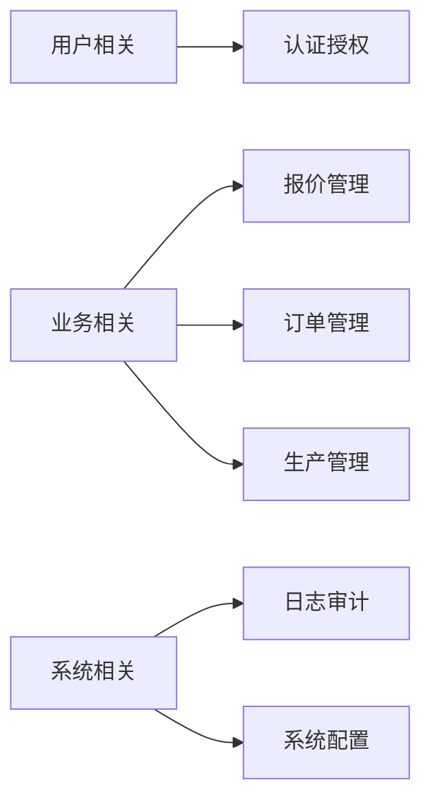

# 门窗生产管理系统数据库设计文档

## 1. 数据库概述

### 1.1 设计目标
- 支持系统所有业务功能
- 确保数据完整性和一致性
- 优化查询性能
- 便于维护和扩展

### 1.2 技术选型
- 数据库：PostgreSQL 16
- ORM：Prisma
- 迁移工具：Prisma Migrate
- 备份工具：pg_dump/pg_restore

## 2. 数据库架构

### 2.1 物理架构


### 2.2 逻辑架构


## 3. 表结构设计

### 3.1 用户认证相关表

```prisma
// 用户表
model User {
  id            Int       @id @default(autoincrement())
  email         String    @unique
  name          String
  passwordHash  String
  role          Role      @default(USER)
  department    String?
  phone         String?
  isActive      Boolean   @default(true)
  lastLoginAt   DateTime?
  createdAt     DateTime  @default(now())
  updatedAt     DateTime  @updatedAt
  quotes        Quote[]
  orders        Order[]
}

// 角色表
model Role {
  id          Int       @id @default(autoincrement())
  name        String    @unique
  description String?
  permissions Json
  createdAt   DateTime  @default(now())
  updatedAt   DateTime  @updatedAt
  users       User[]
}

// 权限表
model Permission {
  id          Int      @id @default(autoincrement())
  name        String   @unique
  code        String   @unique
  description String?
  createdAt   DateTime @default(now())
  updatedAt   DateTime @updatedAt
}
```

### 3.2 客户管理相关表

```prisma
// 客户表
model Customer {
  id           Int       @id @default(autoincrement())
  name         String
  type         String    // 个人/公司
  contact      String?
  phone        String?
  email        String?
  address      String?
  creditLimit  Decimal?
  creditDays   Int?
  isActive     Boolean   @default(true)
  createdAt    DateTime  @default(now())
  updatedAt    DateTime  @updatedAt
  quotes       Quote[]
  orders       Order[]
}

// 客户分组表
model CustomerGroup {
  id          Int       @id @default(autoincrement())
  name        String
  description String?
  discount    Decimal?
  createdAt   DateTime  @default(now())
  updatedAt   DateTime  @updatedAt
  customers   Customer[]
}
```

### 3.3 报价管理相关表

```prisma
// 报价主表
model Quote {
  id            Int           @id @default(autoincrement())
  quoteNumber   String        @unique
  customerId    Int
  customer      Customer      @relation(fields: [customerId], references: [id])
  status        QuoteStatus
  totalAmount   Decimal
  discount      Decimal?
  finalAmount   Decimal
  validUntil    DateTime?
  notes         String?
  createdBy     Int
  creator       User          @relation(fields: [createdBy], references: [id])
  approvedBy    Int?
  approvedAt    DateTime?
  createdAt     DateTime      @default(now())
  updatedAt     DateTime      @updatedAt
  items         QuoteItem[]
  order         Order?
}

// 报价明细表
model QuoteItem {
  id              Int      @id @default(autoincrement())
  quoteId         Int
  quote           Quote    @relation(fields: [quoteId], references: [id])
  productId       Int
  product         Product  @relation(fields: [productId], references: [id])
  width           Decimal
  height          Decimal
  quantity        Int
  unitPrice       Decimal
  discount        Decimal?
  amount          Decimal
  notes           String?
  createdAt       DateTime @default(now())
  updatedAt       DateTime @updatedAt
}
```

### 3.4 订单管理相关表

```prisma
// 订单主表
model Order {
  id            Int           @id @default(autoincrement())
  orderNumber   String        @unique
  quoteId       Int?
  quote         Quote?        @relation(fields: [quoteId], references: [id])
  customerId    Int
  customer      Customer      @relation(fields: [customerId], references: [id])
  status        OrderStatus
  totalAmount   Decimal
  deposit       Decimal?
  balance       Decimal
  deliveryDate  DateTime?
  notes         String?
  createdBy     Int
  creator       User          @relation(fields: [createdBy], references: [id])
  createdAt     DateTime      @default(now())
  updatedAt     DateTime      @updatedAt
  items         OrderItem[]
  batches       BatchOrder[]
}

// 订单明细表
model OrderItem {
  id              Int      @id @default(autoincrement())
  orderId         Int
  order           Order    @relation(fields: [orderId], references: [id])
  productId       Int
  product         Product  @relation(fields: [productId], references: [id])
  width           Decimal
  height          Decimal
  quantity        Int
  unitPrice       Decimal
  amount          Decimal
  notes           String?
  createdAt       DateTime @default(now())
  updatedAt       DateTime @updatedAt
}
```

### 3.5 生产管理相关表

```prisma
// 生产批次表
model Batch {
  id              Int          @id @default(autoincrement())
  batchNumber     String       @unique
  productionDate  DateTime
  status          BatchStatus
  capacity        Int
  notes           String?
  createdBy       Int
  creator         User         @relation(fields: [createdBy], references: [id])
  createdAt       DateTime     @default(now())
  updatedAt       DateTime     @updatedAt
  orders          BatchOrder[]
}

// 批次订单关联表
model BatchOrder {
  id        Int      @id @default(autoincrement())
  batchId   Int
  batch     Batch    @relation(fields: [batchId], references: [id])
  orderId   Int
  order     Order    @relation(fields: [orderId], references: [id])
  sequence  Int
  status    String
  createdAt DateTime @default(now())
  updatedAt DateTime @updatedAt
}
```

## 4. 索引设计

### 4.1 主键索引
- 所有表都使用自增的id字段作为主键
- 使用@id注解标识主键

### 4.2 唯一索引
```sql
-- 用户邮箱唯一索引
CREATE UNIQUE INDEX user_email_idx ON "User"(email);

-- 报价单号唯一索引
CREATE UNIQUE INDEX quote_number_idx ON "Quote"(quoteNumber);

-- 订单编号唯一索引
CREATE UNIQUE INDEX order_number_idx ON "Order"(orderNumber);

-- 批次编号唯一索引
CREATE UNIQUE INDEX batch_number_idx ON "Batch"(batchNumber);
```

### 4.3 普通索引
```sql
-- 客户名称索引
CREATE INDEX customer_name_idx ON "Customer"(name);

-- 订单状态索引
CREATE INDEX order_status_idx ON "Order"(status);

-- 批次生产日期索引
CREATE INDEX batch_production_date_idx ON "Batch"(productionDate);

-- 创建时间索引
CREATE INDEX common_created_at_idx ON "Order"(createdAt);
```

## 5. 数据库优化

### 5.1 性能优化
1. **查询优化**
   - 合理使用索引
   - 优化JOIN查询
   - 使用适当的字段类型
   - 避免SELECT *

2. **配置优化**
   - 调整连接池大小
   - 优化内存分配
   - 设置适当的超时时间
   - 配置查询计划缓存

### 5.2 安全优化
1. **访问控制**
   - 最小权限原则
   - 角色权限管理
   - IP白名单
   - SSL连接

2. **数据安全**
   - 敏感数据加密
   - 定期备份
   - 审计日志
   - 数据恢复方案

## 6. 维护计划

### 6.1 日常维护
1. **监控**
   - 性能监控
   - 空间监控
   - 连接监控
   - 错误监控

2. **备份**
   - 每日增量备份
   - 每周全量备份
   - 备份验证
   - 恢复演练

### 6.2 优化维护
1. **定期优化**
   - 索引重建
   - 统计信息更新
   - 空间回收
   - 性能分析

2. **版本升级**
   - 版本评估
   - 升级计划
   - 测试验证
   - 回滚方案

## 7. 附录

### 7.1 数据字典
[详细的字段说明和约束]

### 7.2 状态定义
[各种状态的详细定义]

### 7.3 关系图
[数据库ER图]

## 5.1 数据库表结构

### 5.1.1 报价管理相关表

1. **quotes 报价表**
```sql
CREATE TABLE quotes (
    id SERIAL PRIMARY KEY,
    quote_number VARCHAR(50) UNIQUE NOT NULL,
    customer_id INTEGER NOT NULL,
    status VARCHAR(20) NOT NULL,
    total_amount DECIMAL(12,2) NOT NULL,
    created_at TIMESTAMP NOT NULL DEFAULT CURRENT_TIMESTAMP,
    updated_at TIMESTAMP NOT NULL DEFAULT CURRENT_TIMESTAMP,
    valid_until DATE,
    notes TEXT,
    created_by INTEGER NOT NULL,
    approved_by INTEGER,
    approved_at TIMESTAMP,
    version INTEGER DEFAULT 1,
    FOREIGN KEY (customer_id) REFERENCES customers(id),
    FOREIGN KEY (created_by) REFERENCES users(id),
    FOREIGN KEY (approved_by) REFERENCES users(id)
);
```

2. **quote_items 报价项目表**
```sql
CREATE TABLE quote_items (
    id SERIAL PRIMARY KEY,
    quote_id INTEGER NOT NULL,
    product_type VARCHAR(50) NOT NULL,
    width DECIMAL(8,2) NOT NULL,
    height DECIMAL(8,2) NOT NULL,
    quantity INTEGER NOT NULL,
    unit_price DECIMAL(10,2) NOT NULL,
    total_price DECIMAL(12,2) NOT NULL,
    specifications JSONB,
    created_at TIMESTAMP NOT NULL DEFAULT CURRENT_TIMESTAMP,
    FOREIGN KEY (quote_id) REFERENCES quotes(id)
);
```

### 5.1.2 订单管理相关表

1. **orders 订单表**
```sql
CREATE TABLE orders (
    id SERIAL PRIMARY KEY,
    order_number VARCHAR(50) UNIQUE NOT NULL,
    quote_id INTEGER,
    customer_id INTEGER NOT NULL,
    status VARCHAR(20) NOT NULL,
    total_amount DECIMAL(12,2) NOT NULL,
    paid_amount DECIMAL(12,2) DEFAULT 0,
    created_at TIMESTAMP NOT NULL DEFAULT CURRENT_TIMESTAMP,
    updated_at TIMESTAMP NOT NULL DEFAULT CURRENT_TIMESTAMP,
    expected_delivery_date DATE,
    actual_delivery_date DATE,
    notes TEXT,
    FOREIGN KEY (quote_id) REFERENCES quotes(id),
    FOREIGN KEY (customer_id) REFERENCES customers(id)
);
```

### 5.2 索引设计

#### 5.2.1 报价相关索引
...