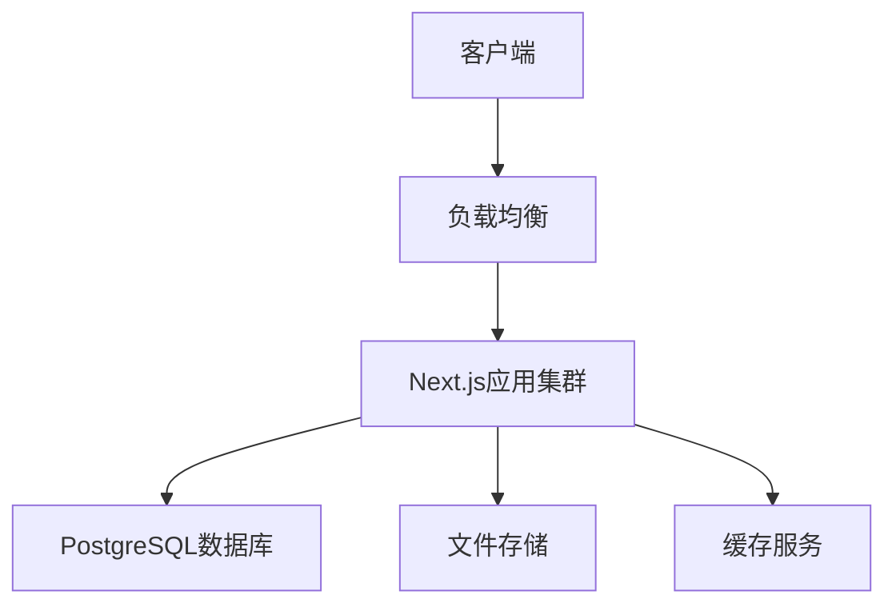
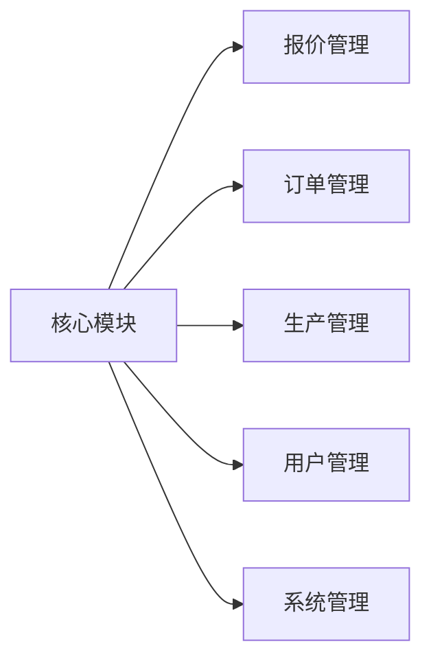

# 门窗生产管理系统设计文档

## 1. 系统架构设计

### 1.1 总体架构


### 1.2 技术栈选型
1. **前端技术**
   - Next.js 14 (App Router)
   - React 18
   - TailwindCSS
   - shadcn/ui
   - React Query
   - Zustand

2. **后端技术**
   - Next.js API Routes
   - Prisma ORM
   - PostgreSQL
   - Redis (可选)

3. **部署环境**
   - Vercel/自托管
   - AWS RDS/自托管数据库
   - AWS S3/自托管文件存储

### 1.3 系统模块划分


## 2. 详细设计

### 2.1 用户认证模块
1. **登录流程**
   ```mermaid
   sequenceDiagram
       Client->>Server: 提交登录信息
       Server->>DB: 验证用户
       DB-->>Server: 返回用户信息
       Server->>Server: 生成JWT
       Server-->>Client: 返回Token
   ```

2. **权限控制**
   - 基于角色的访问控制(RBAC)
   - 权限粒度控制
   - API访问控制
   - 数据访问控制

### 2.2 报价管理模块
1. **报价流程**
   ```mermaid
   graph TD
       A[创建报价] --> B{是否需要审批}
       B -->|是| C[提交审批]
       B -->|否| D[生成报价单]
       C --> E[审批流程]
       E -->|通过| D
       E -->|拒绝| F[退回修改]
   ```

2. **数据流设计**
   - 产品配置数据流
   - 价格计算流程
   - 审批流程设计
   - 文档生成流程

### 2.3 订单管理模块
1. **订单状态流转**
   ```mermaid
   stateDiagram-v2
       [*] --> Draft
       Draft --> Pending
       Pending --> Approved
       Pending --> Rejected
       Approved --> Production
       Production --> Completed
       Completed --> [*]
   ```

2. **订单处理流程**
   - 订单创建/修改
   - 状态管理
   - 文档生成
   - 数据统计

### 2.4 生产管理模块
1. **批次管理**
   - 批次创建
   - 订单分配
   - 进度跟踪
   - 资源调度

2. **生产计划**
   - 产能规划
   - 材料需求
   - 人员安排
   - 设备调度

## 3. 数据库设计

### 3.1 核心表结构
```prisma
// 用户表
model User {
  id        Int      @id @default(autoincrement())
  email     String   @unique
  name      String
  role      Role     @default(USER)
  createdAt DateTime @default(now())
  updatedAt DateTime @updatedAt
}

// 报价表
model Quote {
  id          Int      @id @default(autoincrement())
  customerId  Int
  status      String
  totalAmount Decimal
  createdBy   Int
  createdAt   DateTime @default(now())
  updatedAt   DateTime @updatedAt
}

// 订单表
model Order {
  id           Int      @id @default(autoincrement())
  quoteId      Int?
  customerId   Int
  status       String
  orderNumber  String   @unique
  totalAmount  Decimal
  createdAt    DateTime @default(now())
  updatedAt    DateTime @updatedAt
}

// 生产批次表
model Batch {
  id             Int      @id @default(autoincrement())
  batchNumber    String   @unique
  productionDate DateTime
  status         String
  createdAt      DateTime @default(now())
  updatedAt      DateTime @updatedAt
}
```

### 3.2 索引设计
1. **性能索引**
   - 查询频繁字段
   - 关联查询优化
   - 排序字段优化

2. **业务索引**
   - 唯一性约束
   - 外键关系
   - 状态查询优化

## 4. 接口设计

### 4.1 API规范
1. **RESTful API设计**
   - 资源命名规范
   - HTTP方法使用
   - 状态码规范
   - 错误处理

2. **接口安全**
   - JWT认证
   - 请求验证
   - 参数校验
   - 访问控制

### 4.2 核心接口
1. **用户认证**
   ```typescript
   // 登录
   POST /api/auth/login
   // 刷新token
   POST /api/auth/refresh
   // 登出
   POST /api/auth/logout
   ```

2. **报价管理**
   ```typescript
   // 创建报价
   POST /api/quotes
   // 获取报价列表
   GET /api/quotes
   // 更新报价
   PUT /api/quotes/:id
   ```

3. **订单管理**
   ```typescript
   // 创建订单
   POST /api/orders
   // 获取订单列表
   GET /api/orders
   // 更新订单状态
   PUT /api/orders/:id/status
   ```

## 5. 安全设计

### 5.1 应用安全
1. **认证授权**
   - JWT token验证
   - 角色权限控制
   - Session管理
   - 密码加密存储

2. **数据安全**
   - 敏感数据加密
   - 数据访问控制
   - SQL注入防护
   - XSS防护

### 5.2 系统安全
1. **网络安全**
   - HTTPS加密
   - API限流
   - CORS配置
   - 防火墙设置

2. **运行安全**
   - 日志记录
   - 异常处理
   - 备份恢复
   - 监控告警

## 6. 性能优化

### 6.1 前端优化
1. **加载优化**
   - 代码分割
   - 静态生成
   - 增量静态再生成
   - 图片优化

2. **运行优化**
   - 状态管理优化
   - 渲染优化
   - 缓存策略
   - 网络请求优化

### 6.2 后端优化
1. **数据库优化**
   - 查询优化
   - 索引优化
   - 连接池配置
   - 缓存策略

2. **API优化**
   - 响应压缩
   - 数据分页
   - 批量处理
   - 缓存控制

## 7. 部署方案

### 7.1 Vercel部署
1. **配置要求**
   - 环境变量设置
   - 构建配置
   - 域名配置
   - 监控设置

2. **数据库部署**
   - AWS RDS配置
   - 连接安全组
   - 备份策略
   - 监控告警

### 7.2 自托管部署
1. **服务器要求**
   - 硬件配置
   - 系统要求
   - 网络要求
   - 安全要求

2. **部署步骤**
   - 环境准备
   - 应用部署
   - 数据库部署
   - 监控配置

## 8. 附录

### 8.1 技术文档
- Next.js文档
- Prisma文档
- PostgreSQL文档
- AWS文档

### 8.2 工具文档
- 开发工具配置
- 测试工具说明
- 部署工具说明
- 监控工具说明